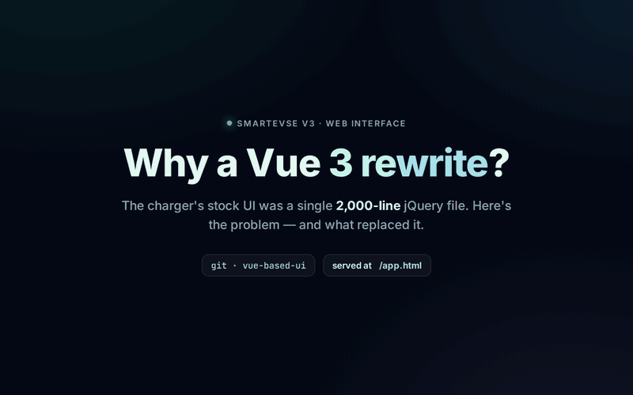

# SmartEVSE Deluxe UI



A modern web interface for the [SmartEVSE V3](https://github.com/dingo35/SmartEVSE-3.5)
EV charger — a Vue 3 rewrite of the device's stock `index.html`. It polls the
controller's `/settings` endpoint and renders a live dashboard, the LCD stream,
and the full set of controls (mode, solar, locks, PWM, MQTT, OCPP, …).

Built with **Vue 3** · **Vite** · **Tailwind CSS v4** · **TypeScript** ·
**Pinia** · **Vue Router**.

## Why this exists

**It works with no internet.** The stock UI pulls jQuery, jQuery Mobile and
Bootstrap from public CDNs (`code.jquery.com`, `cdn.jsdelivr.net`) on every load.
Fine if your SmartEVSE reaches the internet — but on an isolated or air-gapped
network those fetches fail and the page loads broken and unstyled. This rewrite
**inlines everything** (framework, styles, scripts) into one self-contained
`index.html` the device serves itself. Nothing is fetched from outside.

**A modern jacket over the same device.** Same endpoints, write semantics and LCD
protocol — but a component-based, typed app instead of one untyped script. A clean
rewrite, not a port, that adds what the original lacked (see Features), including
an installable **PWA** for your phone's home screen
([Install on your phone](#install-on-your-phone)).

**Much faster to develop.** The stock UI has no build step, so every change must be
flashed before you can see it. Here, `npm run dev` gives instant hot reload — no
flashing per change — and Vite's proxy forwards to a real SmartEVSE on your LAN, so
you develop against **real device data**.

## How it ships

The UI is **built into the firmware and served by the SmartEVSE itself**. The
firmware build (`pio run`) runs [`build_app.py`](../build_app.py), which compiles
the app into one self-contained `index.html` and packs it into flash. The device
serves it at **`/app.html`**, alongside the legacy stock UI at `/`.

Just flash the firmware and open `http://<device>/app.html`.

The two UIs coexist: the legacy page links **"Try the new UI →"** to `/app.html`,
and this app links **"Classic UI"** back to `/`. The build is incremental — the UI
recompiles only when its sources change (`FORCE_APP_BUILD=1` forces it,
`SKIP_APP_BUILD=1` skips it). Compiling needs Node.js; without it the firmware
build skips the UI and ships the legacy one (see
[Building the firmware](../../docs/building_flashing.md)).

## How it works

A single-page client for the SmartEVSE's built-in HTTP server. It holds no backend
of its own — the device is the only source of truth.

- **Poll / commit loop.** One Pinia store ([`src/stores/evse.ts`](src/stores/evse.ts))
  polls `GET /settings` on an interval (default 5s), replacing state wholesale each
  tick. Writes go out as `POST /settings?key=value` (params in the query string,
  empty body — matching the firmware), then refresh immediately, so the UI shows
  device truth, not optimistic state. Polling pauses while the tab is hidden.
- **LCD mirror.** [`src/composables/useLcd.ts`](src/composables/useLcd.ts) opens the
  `/ws/lcd` WebSocket, renders the streamed BMP frames, and sends button presses
  back, reconnecting on host/visibility/online changes.
- **Connection.** Served from the device, an empty **Device address** field means
  same-origin requests. You can also type an address or auto-detect via mDNS
  (`SmartEVSE-<serial>.local`); the choice persists to `localStorage`. Targeting a
  device **by IP from another origin** is cross-origin, and the firmware sends no
  CORS headers — use dev mode for that (its Vite proxy keeps everything same-origin).
- **Relocatable bundle.** Relative asset base (`base: './'`) and hash-based routing,
  so the single `index.html` works at any path with no SPA-fallback config.

## Features

Feature parity with the classic UI, plus two things the single-poll stock page
lacked: **pause/resume the poll loop** and **pause the live LCD stream** — both
saved to `localStorage`, so they persist across reloads.

- **Live dashboard** — EVSE status, EV state (SoC / ETA), current details, mains
  & EV-meter phase currents, EV meter energy, home battery. Cards appear only
  when the device reports the relevant section.
- **Live LCD** — streams the device's screen over WebSocket with Left/Middle/Right
  button control and PIN unlock; the stream can be paused and resumed.
- **Controls** — mode (OFF/PAUSE/NORMAL/SOLAR/SMART), delayed start/stop schedule,
  override current, solar settings, LCD/cable locks, PWM override, autocharge
  (required EVCCID), reboot, firmware update, raw JSON view.
- **Config** — MQTT and OCPP settings with live status.
- **Connection** — set the device address in the UI or **auto-detect via mDNS**
  (`SmartEVSE-<serial>.local`). Polling interval defaults to 5s; pause/resume and
  the chosen device persist across reloads.
- **Installable (PWA)** — ships a web manifest and a service worker, so you can
  add it to your phone's home screen and launch it full-screen, like a native
  app. The shell is cached, so an installed app still opens if the device is
  briefly unreachable (it then shows "disconnected" until it's back). See
  [Install on your phone](#install-on-your-phone).

## Getting Started

Only for running or developing the UI locally. To just use it, flash the firmware
and open `http://<device>/app.html` (see [How it ships](#how-it-ships)).

**Requirements:** Node.js **or** Docker — pick one (Option A or B).

```bash
git clone https://github.com/fossyfox/SmartEVSE-3.5.git
cd SmartEVSE-3.5/SmartEVSE-3/app
```

Both options run the same dev server, on Linux/macOS/Windows, and fix CORS via
Vite's proxy (no firmware change). You just need the device's LAN address.

### Option A — local tools (Node.js)

```bash
npm install
cp .env.example .env       # set VITE_DEVICE_HOST=<device ip or .local>
npm run dev                # http://localhost:5173, hot reload
```

`VITE_DEVICE_HOST` aims the proxy at the device, so leave the in-app **Device
address** empty. No hardware? Use the mock:

```bash
npm run mock               # mock device on http://localhost:8080
VITE_DEVICE_HOST=localhost:8080 npm run dev
```

### Option B — Docker (no local tools)

```bash
DEVICE_HOST=192.168.1.50 docker compose up   # http://localhost:5173
```

Use the device **IP** — a container can't resolve `*.local` (on Linux,
`network_mode: host` lifts that; see [`docker-compose.yml`](docker-compose.yml)).
Stop with `docker compose down` (`-v` also drops the `node_modules` volume).

### Scripts

Run from `SmartEVSE-3/app`:

| Script | Description |
|---|---|
| `npm run dev` | Vite dev server (hot reload). |
| `npm run build` | Type-check + production build to `dist/` (hashed assets). |
| `npm run build:singlefile` | Type-check + single self-contained `dist/index.html` (what the firmware packs). |
| `npm run preview` | Preview the production build. |
| `npm run type-check` | `vue-tsc` only. |
| `npm run mock` | Run the mock SmartEVSE device. |

No test runner — `vue-tsc` (strict) is the only check, and `npm run build` gates on it.

### Configuration (env)

Dev-only (`npm run dev`); the firmware bundle ignores them. Copy
[`.env.example`](.env.example) to `.env`.

| Variable | Description |
|---|---|
| `VITE_DEVICE_HOST` | Device the dev proxy forwards to (IP or `.local`). |
| `VITE_POLL_INTERVAL` | Poll interval in ms (default `5000`). |

## Install on your phone

The UI is a PWA: open it in a phone browser, then pin it to the home screen as a
standalone app (own icon, no browser chrome).

**iPhone / iPad (Safari).** Open `http://<device>/app.html`, then **Share → Add to
Home Screen → Add**. Works straight off the device — iOS doesn't require HTTPS.

**Android (Chrome).** A real install (standalone app / WebAPK) needs a **secure
context** — the only place Chrome registers the service worker and offers to
install. Over the device's plain-HTTP LAN connection, Chrome's menu only makes a
plain shortcut.

A self-signed / click-through `https://` URL doesn't count: Chrome treats cert
errors as insecure and won't register the worker. You need HTTPS with a **trusted**
cert — front the device with an HTTPS reverse proxy / tunnel (e.g. Caddy, a
Cloudflare/Tailscale tunnel) and open that URL. Then use Chrome's **⋮ → Add to Home
screen / Install app**; it launches standalone and works offline-to-shell, like iOS.

> The PWA is best-effort and degrades cleanly: with no service-worker support, the
> app just runs as a normal page — nothing breaks.

## Project structure

```
src/
  lib/         types, fetch/API layer, formatters, mDNS detection, PWA registration
  stores/      Pinia store: connection, polling, write helpers
  composables/ useLcd — LCD WebSocket client
  components/  ui/ (primitives), cards/, control/, config/, AppHeader, AppSidebar
  views/       Dashboard, Stats, Control, Capacity, Mqtt, Ocpp, Firmware
public/        static sidecars: favicon.ico (the device's plug icon), PWA manifest.json,
               app-sw.js, and pwa-192/512 + apple-touch-icon home-screen icons
mock/          dependency-free mock SmartEVSE for offline dev
docker-compose.yml   optional dev-only container (see Getting Started → Option B)
```

The firmware build packs `dist/index.html` (and the PWA `public/` sidecars —
`manifest.json`, `app-sw.js`, the home-screen icons) into the device next to
`/app.html` ([`build_app.py`](../build_app.py), wired into
[`platformio.ini`](../platformio.ini)). The favicon is the device's existing
`favicon.ico`.
